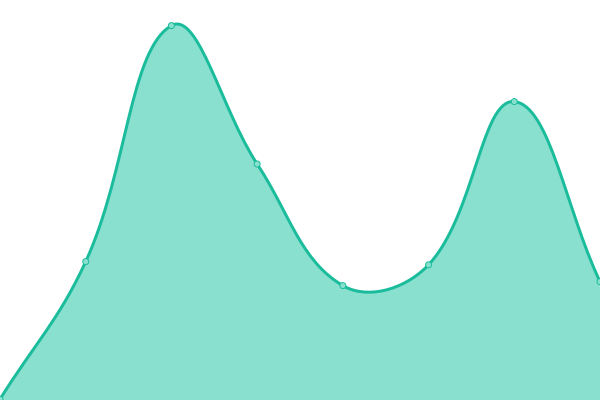
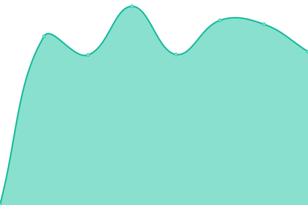
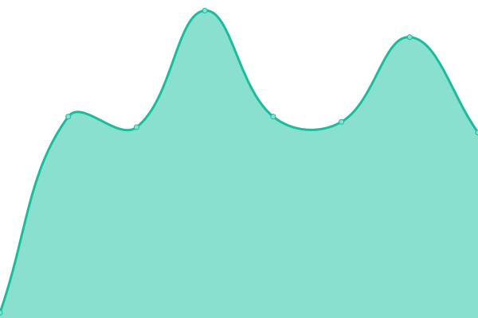
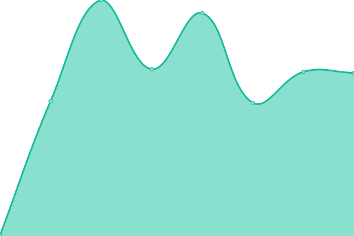
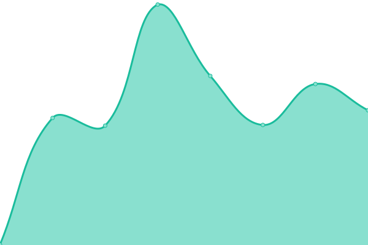
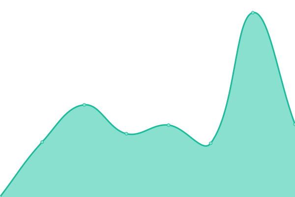
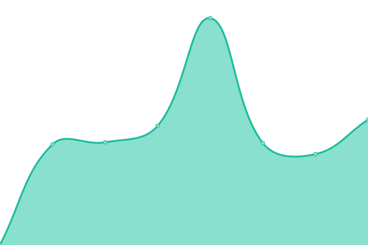
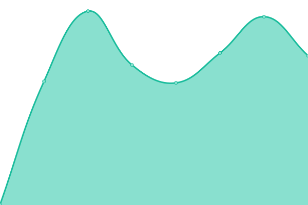
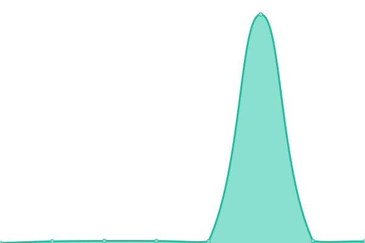

# [📈 Live Status](https://nomisto.github.io/upptime): <!--live status--> **🟧 Partial outage**

This repository contains the open-source uptime monitor and status page for [Simon Ott](https://nomisto.github.io/upptime), powered by [Upptime](https://github.com/upptime/upptime).

With [Upptime](https://upptime.js.org), you can get your own unlimited and free uptime monitor and status page, powered entirely by a GitHub repository. We use [Issues](https://github.com/nomisto/upptime/issues) as incident reports, [Actions](https://github.com/nomisto/upptime/actions) as uptime monitors, and [Pages](https://nomisto.github.io/upptime) for the status page.

<!--start: status pages-->
<!-- This summary is generated by Upptime (https://github.com/upptime/upptime) -->
<!-- Do not edit this manually, your changes will be overwritten -->
<!-- prettier-ignore -->
| URL | Status | History | Response Time | Uptime |
| --- | ------ | ------- | ------------- | ------ |
|  [DOID](https://raw.githubusercontent.com/DiseaseOntology/HumanDiseaseOntology/main/src/ontology/doid.obo) | 🟩 Up | [doid.yml](https://github.com/nomisto/upptime/commits/HEAD/history/doid.yml) | 

 137ms
     
 | 

<a href="https://nomisto.github.io/upptime/history/doid">100.00%</a>
    

|  [GO ontology](http://purl.obolibrary.org/obo/go/go-basic.obo) | 🟩 Up | [go-ontology.yml](https://github.com/nomisto/upptime/commits/HEAD/history/go-ontology.yml) | 

 334ms
     
 | 

<a href="https://nomisto.github.io/upptime/history/go-ontology">100.00%</a>
    

|  [HP](https://raw.githubusercontent.com/obophenotype/human-phenotype-ontology/master/hp.obo) | 🟩 Up | [hp.yml](https://github.com/nomisto/upptime/commits/HEAD/history/hp.yml) | 

 222ms
     
 | 

<a href="https://nomisto.github.io/upptime/history/hp">100.00%</a>
    

|  [UBERON](http://ontologies.berkeleybop.org/uberon/ext.obo) | 🟩 Up | [uberon.yml](https://github.com/nomisto/upptime/commits/HEAD/history/uberon.yml) | 

 268ms
     
 | 

<a href="https://nomisto.github.io/upptime/history/uberon">100.00%</a>
    

|  [Disgenet mapping](http://www.disgenet.org/static/disgenet_ap1/files/downloads/disease_mappings.tsv.gz) | 🟩 Up | [disgenet-mapping.yml](https://github.com/nomisto/upptime/commits/HEAD/history/disgenet-mapping.yml) | 

 1074ms
     
 | 

<a href="https://nomisto.github.io/upptime/history/disgenet-mapping">100.00%</a>
    

|  [STRING mapping](http://string-db.org/mapping_files/entrez/human.entrez_2_string.2018.tsv.gz) | 🟩 Up | [string-mapping.yml](https://github.com/nomisto/upptime/commits/HEAD/history/string-mapping.yml) | 

 247ms
     
 | 

<a href="https://nomisto.github.io/upptime/history/string-mapping">100.00%</a>
    

|  [Uniprot](ftp://ftp.uniprot.org/pub/databases/uniprot/current_release/knowledgebase/idmapping/by_organism/HUMAN_9606_idmapping_selected.tab.gz) | 🟥 Down | [uniprot.yml](https://github.com/nomisto/upptime/commits/HEAD/history/uniprot.yml) | 

 2237ms
     
 | 

<a href="https://nomisto.github.io/upptime/history/uniprot">98.59%</a>
    

|  [Bgee diffexpr](ftp://ftp.bgee.org/bgee_v13/download/calls/diff_expr_calls/Homo_sapiens_diffexpr-anatomy-simple.tsv.zip) | 🟩 Up | [bgee-diffexpr.yml](https://github.com/nomisto/upptime/commits/HEAD/history/bgee-diffexpr.yml) | 

 2046ms
     
 | 

<a href="https://nomisto.github.io/upptime/history/bgee-diffexpr">100.00%</a>
    

|  [Bgee expr](ftp://ftp.bgee.org/current/download/calls/expr_calls/Homo_sapiens_expr_simple.tsv.gz) | 🟩 Up | [bgee-expr.yml](https://github.com/nomisto/upptime/commits/HEAD/history/bgee-expr.yml) | 

 990ms
     
 | 

<a href="https://nomisto.github.io/upptime/history/bgee-expr">100.00%</a>
    

|  [CTD](http://ctdbase.org/reports/CTD_genes_pathways.tsv.gz) | 🟩 Up | [ctd.yml](https://github.com/nomisto/upptime/commits/HEAD/history/ctd.yml) | 

 218ms
     
 | 

<a href="https://nomisto.github.io/upptime/history/ctd">100.00%</a>
    

|  [Disgenet](http://www.disgenet.org/static/disgenet_ap1/files/downloads/curated_gene_disease_associations.tsv.gz) | 🟩 Up | [disgenet.yml](https://github.com/nomisto/upptime/commits/HEAD/history/disgenet.yml) | 

 728ms
     
 | 

<a href="https://nomisto.github.io/upptime/history/disgenet">100.00%</a>
    

|  [Drugcentral](https://unmtid-shinyapps.net/download/DrugCentral/20180826/drugcentral.dump.08262018.sql.gz) | 🟩 Up | [drugcentral.yml](https://github.com/nomisto/upptime/commits/HEAD/history/drugcentral.yml) | 

 42ms
     
 | 

<a href="https://nomisto.github.io/upptime/history/drugcentral">100.00%</a>
    

|  [GO annotations](http://geneontology.org/gene-associations/goa_human.gaf.gz) | 🟩 Up | [go-annotations.yml](https://github.com/nomisto/upptime/commits/HEAD/history/go-annotations.yml) | 

 337ms
     
 | 

<a href="https://nomisto.github.io/upptime/history/go-annotations">100.00%</a>
    

|  [HPO Disease - Phenotype](http://purl.obolibrary.org/obo/hp/hpoa/phenotype_annotation.tab) | 🟩 Up | [hpo-disease-phenotype.yml](https://github.com/nomisto/upptime/commits/HEAD/history/hpo-disease-phenotype.yml) | 

 671ms
     
 | 

<a href="https://nomisto.github.io/upptime/history/hpo-disease-phenotype">100.00%</a>
    

|  [HPO Disease - Phenotype (negative)](http://purl.obolibrary.org/obo/hp/hpoa/phenotype_annotation_negated.tab) | 🟩 Up | [hpo-disease-phenotype-negative.yml](https://github.com/nomisto/upptime/commits/HEAD/history/hpo-disease-phenotype-negative.yml) | 

 398ms
     
 | 

<a href="https://nomisto.github.io/upptime/history/hpo-disease-phenotype-negative">100.00%</a>
    

|  [HPO Disease - Gene](http://purl.obolibrary.org/obo/hp/hpoa/genes_to_phenotype.txt) | 🟩 Up | [hpo-disease-gene.yml](https://github.com/nomisto/upptime/commits/HEAD/history/hpo-disease-gene.yml) | 

 435ms
     
 | 

<a href="https://nomisto.github.io/upptime/history/hpo-disease-gene">100.00%</a>
    

|  [SIDER Indications](http://sideeffects.embl.de/media/download/meddra_all_indications.tsv.gz) | 🟩 Up | [sider-indications.yml](https://github.com/nomisto/upptime/commits/HEAD/history/sider-indications.yml) | 

 768ms
     
 | 

<a href="https://nomisto.github.io/upptime/history/sider-indications">100.00%</a>
    

|  [SIDER Side effects](http://sideeffects.embl.de/media/download/meddra_all_se.tsv.gz) | 🟩 Up | [sider-side-effects.yml](https://github.com/nomisto/upptime/commits/HEAD/history/sider-side-effects.yml) | 

 130ms
     
 | 

<a href="https://nomisto.github.io/upptime/history/sider-side-effects">100.00%</a>
    

|  [STITCH Protein - Drug](http://stitch.embl.de/download/protein_chemical.links.v5.0/9606.protein_chemical.links.v5.0.tsv.gz) | 🟩 Up | [stitch-protein-drug.yml](https://github.com/nomisto/upptime/commits/HEAD/history/stitch-protein-drug.yml) | 

 611ms
     
 | 

<a href="https://nomisto.github.io/upptime/history/stitch-protein-drug">100.00%</a>
    

|  [STITCH Protein - Drug (actions)](http://stitch.embl.de/download/actions.v5.0/9606.actions.v5.0.tsv.gz) | 🟩 Up | [stitch-protein-drug-actions.yml](https://github.com/nomisto/upptime/commits/HEAD/history/stitch-protein-drug-actions.yml) | 

 131ms
     
 | 

<a href="https://nomisto.github.io/upptime/history/stitch-protein-drug-actions">100.00%</a>
    

|  [STRING Protein - Protein](https://stringdb-static.org/download/protein.links.v11.0/9606.protein.links.v11.0.txt.gz) | 🟩 Up | [string-protein-protein.yml](https://github.com/nomisto/upptime/commits/HEAD/history/string-protein-protein.yml) | 

 542ms
     
 | 

<a href="https://nomisto.github.io/upptime/history/string-protein-protein">100.00%</a>
    

|  [STRING Protein - Protein (actions)](https://stringdb-static.org/download/protein.actions.v11.0/9606.protein.actions.v11.0.txt.gz) | 🟩 Up | [string-protein-protein-actions.yml](https://github.com/nomisto/upptime/commits/HEAD/history/string-protein-protein-actions.yml) | 

 2540ms
     
 | 

<a href="https://nomisto.github.io/upptime/history/string-protein-protein-actions">100.00%</a>
    

<!--end: status pages-->

[**Visit our status website →**](https://nomisto.github.io/upptime)

## 📄 License

- Powered by: [Upptime](https://github.com/upptime/upptime)
- Code: [MIT](./LICENSE) © [Simon Ott](https://nomisto.github.io/upptime)
- Data in the `./history` directory: [Open Database License](https://opendatacommons.org/licenses/odbl/1-0/)
